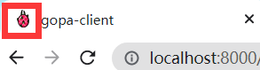

# Gopa-client

This project is initialized with [Ant Design Pro](https://pro.ant.design). Follow is the quick guide for how to use.

## 获取用户信息

新建`src\pages\Test\index.tsx`

```tsx
import React, { useEffect } from 'react';
import { useModel } from 'umi';

const Group: React.FC = () => {
  // 获取用户信息 currentUser对象
  const { initialState } = useModel('@@initialState');
  const { currentUser } = initialState || {};
    
   // 获取用户 username,role...等属性
  const username = currentUser?.username;
  const role = currentUser?.role;

  useEffect(() => {
    console.log('现在是/test测试页面');
  }, []);

  return (
    <div>
      <p>用户信息：{JSON.stringify(currentUser)}</p>
      <p>昵称：{username}</p>
      <p>角色：{role}</p>
    </div>
  );
};

export default Group;
```


## 网站logo,title

### 快捷修改

`\pubilc\logo.svg`，直接替换原有logo.svg

### 仔细修改

#### 页标签logo

`\src\pages\ducument.ejs`




#### 登录页logo

`\src\pages\Login\index.tsx`

```tsx
// 引入logo
const logo = '/logo.svg';

	<LoginForm
        // 设置logo的src
          logo={}
          title="gopa-client"
          subTitle={'gopa-client 是graviti内部管理xxxxx系統'}
          initialValues={{
            autoLogin: true,
          }}
          onFinish={async (values) => {
            await handleSubmit(values as API.LoginParams);
          }}
      />
```


#### menu logo

`\config\defaultSetting.ts`

```ts
// 引入logo
const logo = '/logo.svg';

const Settings: LayoutSettings & {
  logo?: string;
} = {
  title: 'gopa-client',
  logo: logo,	// 设置logo的src
};

export default Settings;
```

## 国际化

只配置了menu的英语EN和中文CN

`\src\locales\en-US\menu.ts`

```ts
export default {
  // routes.ts
  'menu.group': 'group',
  'menu.member': 'member',
  'menu.group-authority': 'group-authority',
  'menu.user': 'user',
  'menu.test': 'test',
 }
```

`\src\locales\zh-CN\menu.ts`

```ts
export default {
  // routes.ts
  'menu.group': '组',
  'menu.member': '成员',
  'menu.group-authority': '组权限',
  'menu.user': '用户',
  'menu.test': '测试_get user',
 }
```


在`\config\routes.ts`中

```ts
//根据name属性，到menu中显示为 menu.name
//例如，group显示为menu.group：在en-US显示为 'group'，在zh-CN显示为'组'
export default [
  { path: '/', redirect: '/group' },
  { path: '/group', name: 'group', icon: 'table', component: './Group' },
]
```


## Environment Prepare

Install `node_modules`:

```bash
npm install
```

or

```bash
yarn
```

## Provided Scripts

Ant Design Pro provides some useful script to help you quick start and build with web project, code style check and test.

Scripts provided in `package.json`. It's safe to modify or add additional script:

### Start project

```bash
npm start
```

### Build project

```bash
npm run build
```

### Check code style

```bash
npm run lint
```

You can also use script to auto fix some lint error:

```bash
npm run lint:fix
```

### Test code

```bash
npm test
```

## More

You can view full document on our [official website](https://pro.ant.design). And welcome any feedback in our [github](https://github.com/ant-design/ant-design-pro).
